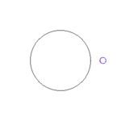

# Physics-based Animation 4860-1081 2025S

Lecture at graduate school of information science and technology in the university of Tokyo, spring semester, 2025

#### ITC-LMS 

For Zoom link, Slack, and GitHub Classroom invitations

- https://utol.ecc.u-tokyo.ac.jp/lms/course?idnumber=2025_4886_4860-1081_01

#### Instructor
Dr. Nobuyuki Umetani 
- email: n.umetani@gmail.com
- url: http://www.nobuyuki-umetani.com/
- lab's website: https://cgenglab.github.io/en/

- Teaching assistants: Kenji Tojo (https://kenji-tojo.github.io/), Yuhan Wu (https://yoharol.github.io/pages/myself/)

#### Time
- Monday 2rd period, 10:25pm - 12:10pm

#### Course Description

Computer-generated images are everywhere in movies, video games, and VR. This course is an introduction to the techniques to animate objects in computer graphics based on the law of physics. The aim of the course is to get familiar with applied mathematics such as linear algebra, vector analysis, partial differential equations, tensor mechanics, variational principle, optimization, and numerical analysis through the animation techniques for particle systems, rigid bodies, and elastic bodies. There are C#/Rust/Python programming assignments to acquire research-oriented graphics programming skills. The students also learn basics use of the computer graphics software Unity and Blender.

Topics:
- mass-spring simulation
- rigid body simulation
- elastic body simulation
- cloth and hair modeling & simulation
- collision-detection using spatial hashing
- finite boundary method

## Lecture Schedule

| Day | Topic | Assignment       | Slide |
|:----|:---|:-----------------|-----|
| (1)  Apr. 7 | **Introduction** Data structure for simulation, Explicit/implicit shape representation |                  | [1,2] |
| (2)  Apr. 21 | **Programming 1** Introduction to Rust language, GitHub | [task00](task00) | [3,4] |
| (3)  Apr. 28 | **Time Integration** Backward & forward Euler method, particle system, Barnes–Hut method | [task01](task01) | [5,6] |
| (4)  May 8 | **Newtonian Mechanics** | task02           |     |
| (5)  May 12 | **Collision Detection** principal component analysis sort & sweep method, bounding volume hierarchy  | task03           |     |
| (6)  May 19 | **Optimization** Hessian & Jacdobian, Sparse matrix data structure, Conjugate gradient method | task04           |     |
| (7)  May 26 | **Simple Elastic Energy** Newton-Raphson method mass-spring system | task05           |     |
| (8)  June 9 | **Programming 2** Introduction to Unity & C# | task06           |     |
| (9)  June 16 | **Dynamic Simulation** Variational time integration | task07           |     |
| (10)  June 23 | **Optimization with Constraint**  Lagrange multiplier method | task08           |     |
| (11)  June 30 | **Rotation** Rotation representation | task09           |     |
| (12)  July 7 | **Rigid Body Dynamics**  inertia tensor,  angular velocity | task10           |     |
| (13)  July 14 | **Continuum Mechanics**  tensor,  finite element method |                  |     |

#### Slides

- [1] [Introduction](http://nobuyuki-umetani.com/pba2025s/introduction.pdf)
- [2] [Data Structure](http://nobuyuki-umetani.com/pba2025s/data_structure.pdf)
- [3] [Rust](http://nobuyuki-umetani.com/pba2025s/rust.pdf)
- [4] [Git & GitHub](http://nobuyuki-umetani.com/pba2025s/git_wo_link.pdf) 
- [5] [Time Integration](http://nobuyuki-umetani.com/pba2025s/time_integration.pdf)
- [6] [Floating Point Number](http://nobuyuki-umetani.com/pba2025s/floating_point_number.pdf)

## Grading

- 20% lecture attendance
  - Attendance is counted based on writing a secret keyword on LMS. The keyword is announced for each lecture.  
- 80% small assignments
  - see below

#### Assignments

There are many small programming assignments. To do the assignments, you need to create your own copy of this repository through **GitHub Classroom**.  These assignements needs to be submitted using **pull request** functionality of the GitHub. Look at the following document. 

[How to Submit the Assignments](doc/submit.md)

| Task ID          | Language | Title (tantative) | Thumbnail                 |
|:-----------------| :--- | :------------------------ |:--------------------------|
| [task00](task00) | Rust | Building Rust project & submitting GitHub pull request |  |
| [task01](task01) | Rust | Implicit Time Integration |  |
| task02           | Rust | Linear Momentum Conservation |                           |
| task03           | Rust | Acceleration of N-body Simulation |                           |
| task04           | Rust | Accelerated nearest search using Kd-Tree |                           |
| task05           | Rust | Solving Laplace equation with Gauss-Seidel Method |                           |
| task06           | C# | Gradient Descent for Mass-Spring Simulation |                           |
| task07           | C# | Dynamic Mass-spring System using Variational Euler Time Integration |                           |
| task08           | C# | Controlling Volume of a Mesh using Lagrange-Multiplier Method |                           |
| task09           | C# | Rotation and Energy Minimization |                           |
| task10           | C# | Simulation of Rigid Body Precession |                           |

#### Policy

- Do the assignment by yourself. Don't share the assignments with others.
- Don't post the answers of the assignment on Slack 
- Late submission of an assignment is subject to grade deduction
- Score each assignment will not be open soon (instructor needs to adjust weights of the score later)
- You can use AIs tool for coding.

## Reading Material

- [Ten Min Physics (Youtube channel)](https://www.youtube.com/@TenMinutePhysics/videos)
- [Physically Based Modeling: Principles and Practice, Siggraph '97 Course notes by Dr. Baraff](http://www.cs.cmu.edu/~baraff/sigcourse/index.html)
- [Physics-Based Animation  by Kenny Erleben et al. (free textobook about rigid body dynamics)](https://iphys.wordpress.com/2020/01/12/free-textbook-physics-based-animation/)
- [Dynamic Deformables: Implementation and Production Practicalities, SIGGRAPH 2020 Courses](http://www.tkim.graphics/DYNAMIC_DEFORMABLES/)
- [Awesome Computer Graphics (GitHub)](https://github.com/luisnts/awesome-computer-graphics)
- [Skinning: Real-time Shape Deformation SIGGRAPH 2014 Course](https://skinning.org/)

#### My Past Lectures
- [Applied Computer Graphics 2024S](https://github.com/nobuyuki83/Applied_Computer_Graphics_2024S)
- [Physics-based Animation 2023S](https://github.com/nobuyuki83/Physics-based_Animation_2023S)
- [Applied Computer Graphics 2022S](https://github.com/nobuyuki83/Applied_Computer_Graphics_2022S)
- [Physics-based Animation 2021S](https://github.com/nobuyuki83/Physics-based_Animation_2021S)
