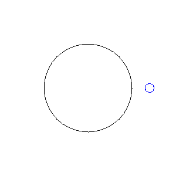
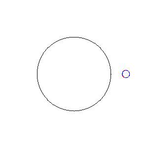

# Task01: Implicit Time Integration


**Deadline: May 1st (Thu) at 15:00pm**

----

## Before Doing Assignment

If you have not done the [task00](../task00), do it first to set up the rust development environment.

Before doing the assignment `task01`, we need to update your remote/local repositories.     
1. Go to your remote GitHub repository at `https://github.com/PBA-2025/pba-<username>`. 
2. Click `Pull Requests` tab around the top.
3. There should be one pull request with name `GitHub Classroom: Sync Assignment`, click it.
4. Click the green `Merge pull request` button.

Now your remote repository is updated. Let's update your local repository. 

```bash
$ cd pba-<username>  # go to the local repository
$ git checkout main  # set main branch as the current branch
$ git branch -a       # make sure you are in the main branch
$ git fetch origin main  # download the main branch from the remote repository
$ git reset --hard origin/main # reset the local main branch same as remote repository
```

If you encounter some errors, give up updating your local repository. 
Instead, clone the remote repository in a new location (see [task00](../task00) for cloning).      

Create the `task01` branch and set it as the current branch.

```bash
$ git branch task01    # create task1 branch
$ git checkout task01  # switch into the task1 branch
$ git branch -a       # make sure you are in the task1 branch
```

Now you are ready to go!

---

## Problem 0

Run the code

```bash
cargo run --release
```
You will see `result.gif`. Rename it to `problem0.gif`, then you will see the image below: 



This program simulates the motion of small objects under gravity. 
It solves the equation of motion ${d^2 r}/{d t^2} = - {1}/{r^2}$ and visualize it in the polar coordinate.
Note that the equation is 1D. The angle of the polar coordinate represent time.    
The falling circle bounce at the surface $r=0.5$. 
The movement of ***red circle*** is integrated using the ***forward time integration***. 
Observe the energy gain artifact.

## Problem 2

Modify the code at `line #53` in [src/main.rs](src/main.rs) to integrate the equation of motion using the ***backward (implicit) euler method*** scheme for the movement of ***red object***.

After the edit, run the code and rename the `result.gif` to `problem1.gif`.  You will see the result below.

`task01/problem1.gif`




After the coding clean your code using the following commands.  
```bash
$ cargo clippy #  code improvement suggestion
$ cargo fmt # code formatter
```


## After Doing the Assignment

After modifying the code, push the code in the `task01` branch to the `task01` branch of the remote repository.

```bash
$ cd pba-<username>    # Go to the top of the repository
$ git branch -a  # Make sure again you are in the task1 branch
$ git status  # check the changes (typically few files are shown to be "updated")
$ git add .   # stage the changes
$ git status  # check the staged changes (typically few files are shown to be "staged")
$ git commit -m "task01 finished"   # The comment can be anything
$ git push --set-upstream origin task01  # update the task1 branch of the remote repository
```

got to the GitHub webpage `https://github.com/PBA-2025/pba-<username>`. 
If everything looks good on this page, make a pull request.


## Notes

- Do not submit multiple pull requests. Only the first pull request is graded
- Do not close the pull request by yourself. The instructor will close the pull request
- If you mistakenly merge the pull request, it's OK, but be careful not to merge next time. 

