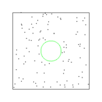
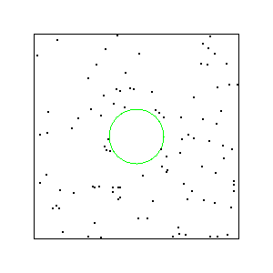
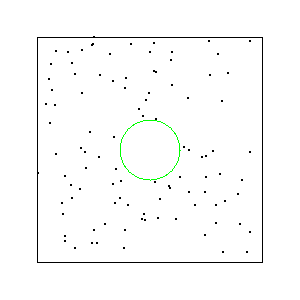

# Task02: Linear Momentum Conservation 



**Deadline: May 11 (Sun) at 15:00pm**

----

## Before Doing Assignment

If you have not done the [task00](../task00), do it first to set up the rust development environment.

You do not need to accept a pull request from the GitHub classroom anymore (the instructor synchronizes your remote repository using a script). 
First, please update your local repository.

```bash
$ cd pba-<username>  # go to the local repository
$ git checkout main  # set main branch as the current branch
$ git branch -a       # make sure you are in the main branch
$ git fetch origin main  # download the main branch from the remote repository
$ git reset --hard origin/main # reset the local main branch same as remote repository
```

If you encounter some errors, give up updating your local repository and restart from the remote repository. 
In other words, clone the remote repository in a new location (see [task00](../task00) for cloning).

Create the `task02` branch and set it as the current branch.

```bash
$ git branch task02    # create task02 branch
$ git checkout task02  # switch into the task02 branch
$ git branch -a       # make sure you are in the task02 branch
```

Now you are ready to go!

---

## Problem 0

Run the code

```bash
cd pba-<username>/task02 
cargo run --release
```

This program output a gif animation as `output.gif`. Rename the `output.gif` to `problem0.gif`. 
Below, you will see the gif animation of many particles bump into a fixed ball.



## Problem 1

Let's simulate [Brownian motion](https://en.wikipedia.org/wiki/Brownian_motion).

Implement the collision between ball and particle. The coefficient of restitution is 1, e.g., the magnitude of relative velocity does not change after the collision.
`line 56`  in [main.rs](src/main.rs) to modify the code to simulate the collision between the ball and a particle.

The linear momentum should be conserved. The force between ball and particle should only in the normal direction (e.g, `plane_norm`). In other words, there is
no friction. You do not need to change the positions (accurate position computation is actually too complicated for this assignment).

Run the code and save the `output.gif` as `problem1.gif`. The image blow should be updated.




## After Doing the Assignment

Please improve & format your code. Fix the code if `clippy` outputs some improvement suggestions.

```bash
cargo clippy # check if the code can be improved   
cargo fmt # format the code
```

After modifying the code, push the code in the `task02` branch to the `task02` branch of the remote repository.

```bash
$ cd pba-<username>    # Go to the top of the repository
$ git branch -a  # Make sure again you are in the task02 branch
$ git status  # check the changes (typically few files are shown to be "updated")
$ git add .   # stage the changes
$ git status  # check the staged changes (typically few files are shown to be "staged")
$ git commit -m "task02 finished"   # The comment can be anything
$ git push --set-upstream origin task02  # update the task02 branch of the remote repository
```

got to the GitHub webpage `https://github.com/PBA-2025/pba-<username>`.
If everything looks good on this page, make a pull request.


## Notes
- Do not submit multiple pull requests. Only the first pull request is graded
- Do not close the pull request by yourself. The instructor will close the pull request
- If you mistakenly merge the pull request, it's OK, but be careful not to merge next time.
