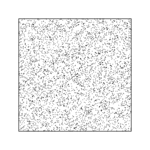
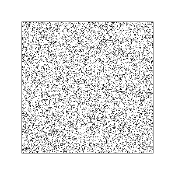
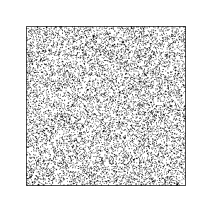

# # Task03: Acceleration of N-body Simulation



**Deadline: May 15 (Thu) at 15:00pm**

----

## Before Doing Assignment

If you have not done the [task00](../task00), do it first to set up the rust development environment.

First, please update your local repository.

```bash
$ cd pba-<username>  # go to the local repository
$ git checkout main  # set main branch as the current branch
$ git branch -a       # make sure you are in the main branch
$ git fetch origin main  # download the main branch from the remote repository
$ git reset --hard origin/main # reset the local main branch same as remote repository
```

If you encounter some errors, give up updating your local repository and restart from the remote repository. 
In other words, clone the remote repository in a new location (see [task00](../task00) for cloning).

Create the `task03` branch and set it as the current branch.

```bash
$ git branch task03    # create task02 branch
$ git checkout task03  # switch into the task02 branch
$ git branch -a       # make sure you are in the task02 branch
```

Now you are ready to go!

---

## Problem 0

Run the code with command line option. This program is computationally expensive probably takes 5 to 15 seconds. Do not forget the `--release` option.

```bash
cd pba-<username>/task03
cargo run --release -- --num-particle 2500
```

This program computes [n-body simulation](https://en.wikipedia.org/wiki/N-body_simulation), where the particles move while attracting each others.

| #particle | time w/o acceleration (sec) | time w/ acceleration (sec) |
|-----------|-----------------------------|----------------------------|
| 2500      | ?                           | ?                          |
| 5000      | ?                           | ?                          |
| 10000     | ?                           | ?                          |

Run the program with different numbers of the particles (2.5k, 5k, and 10k) by changing the command line option `--num_particle`. 
Record the computation time by filling the 2nd column of the table above.

Observe the quadratic computational cost (x2 particle result in x4 time).

This program output a gif animation as `output.gif`. For the case of 10k particle, rename the `output.gif` to `problem0.gif`.
Below, you will see the gif animation.



## Problem 1

The current code compute the n-body simulation in the brute-force way. 
This is expensive as the computational cost is O(N^2). 
Let's accelerate the computation a bit using the grid-based acceleration structure.

Based on the [Barnes-Hut simulation](https://en.wikipedia.org/wiki/Barnes%E2%80%93Hut_simulation), 
we separate the near field influence and far field approximation.

Each grid has representative particle at the center of the gravity of the particles in that grid.
The representative particle has all the weights of the particles in the grid. 
The force from a far particle is approximated by the force from the representative particle of the grid the particle belong.

We use the jagged array data structure to efficiently find the particles inside a grid.
Modify the code around `line #137` to compute the force from particles in far grid.
Also, look around `line #77` to understand how the jagged array is constructed. 

Run the program with different numbers of the particles (2.5k, 5k, and 10k). 
This time put the `--accelerate` option in the command line.

```bash
cd pba-<username>/task03
cargo run --release -- --num-particle 2500 --accelerate
```

Record the computation time by filling the 3rd column in the table above.
Observe that the computational cost is better than quadratic.


For 10k particles, rename the `output.gif` as `problem1.gif`. 




## After Doing the Assignment

Please improve & format your code. Fix the code if `clippy` outputs some improvement suggestions.

```bash
cargo clippy # check if the code can be improved   
cargo fmt # format the code
```

After modifying the code, push the code in the `task03` branch to the `task03` branch of the remote repository.

```bash
$ cd pba-<username>    # Go to the top of the repository
$ git branch -a  # Make sure again you are in the task02 branch
$ git status  # check the changes (typically few files are shown to be "updated")
$ git add .   # stage the changes
$ git status  # check the staged changes (typically few files are shown to be "staged")
$ git commit -m "task03 finished"   # The comment can be anything
$ git push --set-upstream origin task03  # update the task03 branch of the remote repository
```

got to the GitHub webpage `https://github.com/PBA-2025/pba-<username>`.
If everything looks good on this page, make a pull request.


## Notes
- Do not submit multiple pull requests. Only the first pull request is graded
- Do not close the pull request by yourself. The instructor will close the pull request
- If you mistakenly merge the pull request, it's OK, but be careful not to merge next time.
