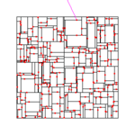
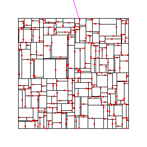

# # Task04: Accelerated Nearest Search using Kd-Tree



**Deadline: May 22 (Thu) at 15:00pm**

----

## Before Doing Assignment

If you have not done the [task00](../task00), do it first to set up the rust development environment.

First, update your local repository.

```bash
$ cd pba-<username>  # go to the local repository
$ git checkout main  # set main branch as the current branch
$ git branch -a       # make sure you are in the main branch
$ git fetch origin main  # download the main branch from the remote repository
$ git reset --hard origin/main # reset the local main branch same as remote repository
```

If you encounter some errors, give up updating your local repository and restart from the remote repository. 
In other words, clone the remote repository in a new location (see [task00](../task00) for cloning).

Create the `task04` branch and set it as the current branch.

```bash
$ git branch task04    # create task04 branch
$ git checkout task04  # switch into the task04 branch
$ git branch -a       # make sure you are in the task04 branch
```

Now you are ready to go!

---

## Problem 0

Run the code with command line option. 

```bash
cd pba-<username>/task04
cargo run --release -- --vis --num-particle 300
```

This program output a gif animation as `problem0.gif`. Below, you will see the gif animation.



This program computes the nearest distance from a point to a set of points in a 2D setting.

The `--num_particle` option control the number of particles.

## Problem 1

Run the program without `--vis` option, as
```bash
cd pba-<username>/task04
cargo run --release -- --num-particle N
```
Then, the program computes the nearest distance between `N` particles against `N` particles and report the computation time.

There are 3 types of computation `brute force`, `kd-tree naive` and `kd-tree faster`. 
Fill the 1st column of the table below for the `brute force` by running the program with different numbers of the particles (10k, 20k, and 40k) by changing the command line option `--num-particle`.

| #particle | time bruteforce (ms) | time kd-tree naive (ms) | time kd-tree faster |
|-----------|----------------------|-------------------------|---------------------|
| 10k       | ?                    | ?                       | ?                   |
| 20k       | ?                    | ?                       | ?                   | 
| 40k       | ?                    | ?                       | ?                   |

Observe the quadratic computational cost (x2 particle result in x4 time) for the brute force computation.

Currently, the program does not **cull the tree branch**, and nearest distance computation using Kd-tree is slow.
Let's fix it. 

First, change the line #194, such that it culls the kd-tree's branch when the branch does not contain the points that is nearer to the current nearest candidate.
Use the function `signed_distance_aabb` to compute the distance between a point and the rectangle covered by the node.
Fill the 2nd column of the table above. Observe that the computational cost changes linearly to the number of particle. 


Second, Let's  accelerate the tree search by changing the order of the evaluation of the branch.
Kd-tree is the binary tree i.e., there is left node and right node. 
Change the code around line #269 and line #285 such that if left branch is closer to the right branch evaluate left branch and vice versa.
Fill the 3rd column of the table above. Observe that the computational cost changes linearly to the number of particles and the program runs much faster than the naive one.


Make sure the program run without assertion failure. 


## After Doing the Assignment

Please improve & format your code. Fix the code if `clippy` outputs some improvement suggestions.

```bash
cargo clippy # check if the code can be improved   
cargo fmt # format the code
```

After modifying the code, push the code in the `task04` branch to the `task04` branch of the remote repository.

```bash
$ cd pba-<username>    # Go to the top of the repository
$ git branch -a  # Make sure again you are in the task02 branch
$ git status  # check the changes (typically few files are shown to be "updated")
$ git add .   # stage the changes
$ git status  # check the staged changes (typically few files are shown to be "staged")
$ git commit -m "task04 finished"   # The comment can be anything
$ git push --set-upstream origin task04  # update the task04 branch of the remote repository
```

got to the GitHub webpage `https://github.com/PBA-2025/pba-<username>`.
If everything looks good on this page, make a pull request.


## Notes
- Do not submit multiple pull requests. Only the first pull request is graded
- Do not close the pull request by yourself. The instructor will close the pull request
- If you mistakenly merge the pull request, it's OK, but be careful not to merge next time.
