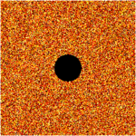
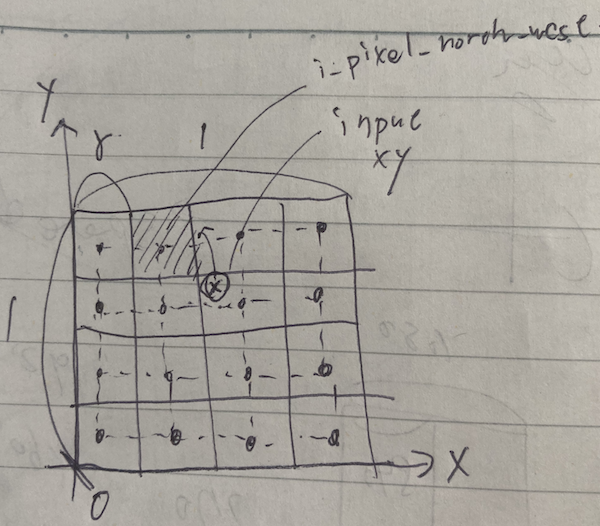
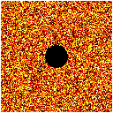

# Task05: Dirichlet's Energy Minimization with Gauss-Seidel Method



**Deadline: May 29 (Thu) at 15:00pm**

----


## Before Doing Assignment

If you have not done the [task00](../task00), do it first to set up the rust development environment.

First, update your local repository.

```bash
$ cd pba-<username>  # go to the local repository
$ git checkout main  # set main branch as the current branch
$ git branch -a       # make sure you are in the main branch
$ git fetch origin main  # download the main branch from the remote repository
$ git reset --hard origin/main # reset the local main branch same as remote repository
```

If you encounter some errors, give up updating your local repository and restart from the remote repository.
In other words, clone the remote repository in a new location (see [task00](../task00) for cloning).

Create the `task05` branch and set it as the current branch.

```bash
$ git branch task05    # create task05 branch
$ git checkout task05  # switch into the task04 branch
$ git branch -a        # make sure you are in the task05 branch
```

Now you are ready to go!

---

## Problem 0

Run the code with command line option.

```bash
cd pba-<username>/task05
cargo run --release -- --img-resolution 256
```

The program output the Dirichlet energy.
The Dirichlet's energy here is defined as the sum of the squared difference of the adjacent grid cells.
Write the number below. 

| Dirichlet's energy in the initial state at resolution=256 |
|-----------------------------------------------------------|
| ???                                                       |


## Problem 1

Minimize Dirichlet's energy using Gauss-Seidel method by writing a few lines of code around `line #111` to minimize Dirichlet's energy using Gauss-Seidel method. 
Do not write complicated or long code.

```bash
cd pba-<username>/task05
cargo run --release -- --img-resolution 256
```

If the code is correct, you observe that the Dirichlet energy decrease steadily.
Write the Dirichlet energy after the 1000 iteration output by the program.  

| Dirichlet's energy in the final state at resolution=256 |
|---------------------------------------------------------|
| ???                                                     |


## Problem 2

Let's assume that the value at the pixel stands for the temperature at the center of the pixel.
From the temperature at the center of the pixel, we can compute the temperature at arbitrary location in the grid by *bi-linear interpolation*.   
Compute the gradient of the temperature such that we can move the particles in the direction of the negative gradient. 

Compute the north-west pixel at given location `xy` by changing around the `line #11` (see the illustration below).




Make sure your code can past the test.

```bash
cd pba-<username>/task05
cargo test --release 
```

Then compute the gradient of the *bi-linear interpolation* around the `line #66`.

Run the code with different resolution by setting `--image-resolution` as `128`, `256`, and `512`. 

```bash
cd pba-<username>/task05
cargo run --release -- --img-resolution ???
```

save the `output.gif` as `problem1_128.gif`, `problem1_256.gif` and `problem1_256.gif` so you can see the animation below.




Observe that convergence of the Gauss-Seidel method become slower for the large grid. 

## After Doing the Assignment

Please improve & format your code. Fix the code if `clippy` outputs some improvement suggestions.

```bash
cargo clippy # check if the code can be improved   
cargo fmt # format the code
```

After modifying the code, push the code in the `task05` branch to the `task05` branch of the remote repository.

```bash
$ cd pba-<username>    # Go to the top of the repository
$ git branch -a  # Make sure again you are in the task05 branch
$ git status  # check the changes (typically few files are shown to be "updated")
$ git add .   # stage the changes
$ git status  # check the staged changes (typically few files are shown to be "staged")
$ git commit -m "task05 finished"   # The comment can be anything
$ git push --set-upstream origin task05  # update the task05 branch of the remote repository
```

got to the GitHub webpage `https://github.com/PBA-2025/pba-<username>`.
If everything looks good on this page, make a pull request.


## Notes
- Do not submit multiple pull requests. Only the first pull request is graded
- Do not close the pull request by yourself. The instructor will close the pull request
- If you mistakenly merge the pull request, it's OK, but be careful not to merge next time.