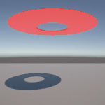
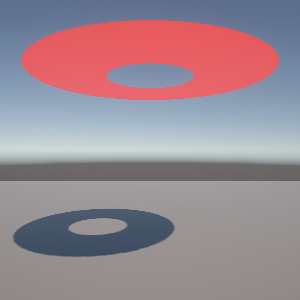
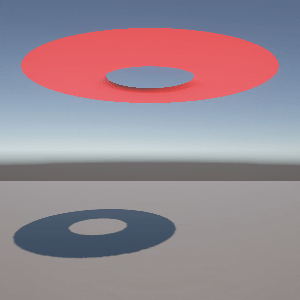

# Task06: Gradient Descent Method for Mass-Spring Simulation

**Deadline: June 12 (Thu) at 15:00pm**

----

## Before Doing Assignment

If you have not installed Unity on your computer, please install. 

---

## Problem 1

Do the following procedure:

### Create Project
- In the `UnityHub`, make a new Unity project named `task06` under `pba-<username>/task06`.
- You will see project related folders like `pba-<username>/task06/task06/Assets`.

### Create Plane
- Add a 3D plane by left click menu in the `Hiearchy` window (top-left), `3D Object` > `Plane`.
- Make sure the position of the plane at `(0., 0., 0.)`
- Keep the other parameters default (e.g., scale is `(1., 1., 1.)`)

### Set Camera
- Set the position of the `Main Camera` to `(0.0, 0.8, -1.8)`.
- Keep the other parameters default (Field of View is `60`).

### Import Mesh
- Import the `pba-<username>/task06/annulus.obj` to the asset by dragging it into the `Assets` window (bottom).
- Click `annulus` prefab in the `Assets` window. You will see `inspector` window on the right. In the `Model` tab, enable `Read/Write` checkbox.
- Import the `annulus` Prefab to the scene by dragging `annulus` in the `Assets` window (bottom) to the `Hierarchy` window (top-left).
- In the `Hierarchy`window, click `default` GameObject under the `annulus` prefab.
- Set the position of the `annulus` to `(0.0, 1.3, 0.0)`. Make sure `annulus > default`'s position is `(0., 0., 0.)`. 

### Set Material to the Mesh
You do not see the `annulus` objet in the `Game` window (center) because default material do not show the back side of the faces. Let's fix it by creating new material.
- Make a new material by selecting the right click menu in the `Assets` window (bottom) `Create > Rendering > Material`.
- Click the `New Material` in the `Asssets` window (bottom) to show `Inspector`window (right)
- Set the material color red by click the `Base Map` and set the RGB color as `(255,0,0)`.
- Click the `Render Face` pull down manu in `Surface Options` and select `Both`
- Drag the `New Material` to the `annulus > default` in the `Hiearchy` window (left).

### Take a screenshot
- Set the window resolution to 300x300. 
- Set up the ｀Recoder｀ package for screenshot image (see the [Lecture Material about Unity](http://nobuyuki-umetani.com/pba2025s/unity.pdf))
- Capture the frame 0.
- Rename the screenshot image and place it as `pba-<username>/task06/problem1.png`

## Problem 2

### Add Collider 
- Add a sphere collider component to the GameObject, `annulus > default`, by clicking "Add Component" in the `inspector` window of the `annulus > default` GameObject.
- Set the radius of the sphere collider to `0.31`

### Modify the Code
- Drag `pba-<username>/task06/MyCloth.cs` and `pba-<username>/task06/TopologyOfTriMesh.cs` to the `Assets` window. 
- Attach `MyCloth.cs` in the `Assets` window to the `default` GameObject.

### Modify the Code
This program means to compute deformation of skirt as a mass-spring system. 
Run the program, and you will see the total energy in the `Console` window. 
And this energy should be minimized.

The current code does not compute the gradient of the elastic energy of a spring. 
Hence, the energy minimization does not lead to elastic deformation.      

Write a few lines of code around `line #94` in the `pba-<username>/task06/task06/Assets/MyCloth.cs` to compute the gradient for gradient descent.

### Take a screenshot
- Set the window resolution to 300x300.
- Set up the `Recorder` package for screenshot video (see the [Lecture Material about Unity](http://nobuyuki-umetani.com/pba2025s/unity.pdf))
- Capture the screen from 0th to 300th frame.
- Rename the screenshot image and place it as `pba-<username>/task06/problem2.gif`

Write down the converged minimum value of the energy by updating the text below.

| minimum energy of the system |
|------------------------------|
| -101.1507                    |

## After Doing the Assignment

After modifying the code, push the code and submit a pull request.

## Notes
- The lecture do not explain detail of Unity and C#. Find your self on the internet or using chat AI (e.g., ChatGPT). 
- Do not submit multiple pull requests. Only the first pull request is graded
- Do not close the pull request by yourself. The instructor will close the pull request
- If you mistakenly merge the pull request, it's OK, but be careful not to merge next time. 
