# Task07: Dynamic Mass-spring System using Variational Euler Time Integration

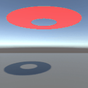

**Deadline: June 19 (Thu) at 15:00pm**

----

## Before Doing Assignment

If you have not installed Unity & Blender on your computer, install them if they are not installed on your computer.

First, update your local repository.

```bash
$ cd pba-<username>  # go to the local repository
$ git checkout main  # set main branch as the current branch
$ git branch -a       # make sure you are in the main branch
$ git fetch origin main  # download the main branch from the remote repository
$ git reset --hard origin/main # reset the local main branch same as remote repository
```

If you encounter some errors, give up updating your local repository and restart from the remote repository.
In other words, clone the remote repository in a new location (see [task00](../task00) for cloning).

Create the `task07` branch and set it as the current branch.

```bash
$ git branch task07    # create task07 branch
$ git checkout task07  # switch into the task07 branch
$ git branch -a        # make sure you are in the task07 branch
```

Now you are ready to go!

---

## Problem 1

Do the following procedure (mostly similar to `task06`).

### Create Project
- In the `UnityHub`, make a new Unity project named `task07` under `pba-<username>/task07`.
- You will see project related folders like `pba-<username>/task07/task07/Assets`.

### Create Plane
- Add a 3D plane by left click menu in the `Hiearchy` window (top-left), `3D Object` > `Plane`.
- Make sure the position of the plane at `(0., 0., 0.)`
- Keep the other parameters default (e.g., scale is `(1., 1., 1.)`)

### Set Camera
- Set the position of the `Main Camera` to `(0.0, 0.8, -1.8)`.
- Keep the other parameters default (Field of View is `60`).
- Set the window resolution to `300x300`.

### Import Mesh
- Import the `pba-<username>/task07/annulus.obj` to the asset by dragging it into the `Assets` window (bottom).
- Click `annulus` prefab in the `Assets` window. You will see `inspector` window on the right. In the `Model` tab, enable `Read/Write` checkbox.
- Import the `annulus` Prefab to the scene by dragging `annulus` in the `Assets` window (bottom) to the `Hierarchy` window (top-left).
- In the `Hierarchy`window, click `default` GameObject under the `annulus` prefab.
- Set the position of the `annulus` to `(0.0, 1.3, 0.0)`. Make sure `annulus > default`'s position is `(0., 0., 0.)`. 

### Set Material to the Mesh
You do not see the `annulus` objet in the `Game` window (center) because default material do not show the back side of the faces. Let's fix it by creating new material.
- Make a new material by selecting the right click menu in the `Assets` window (bottom) `Create > Rendering > Material`.
- Click the `New Material` in the `Asssets` window (bottom) to show `Inspector`window (right)
- Set the material color red by click the `Base Map` and set the RGB color as `(255,0,0)`.
- Click the `Render Face` pull down manu in `Surface Options` and select `Both`
- Drag the `New Material` to the `annulus > default` in the `Hiearchy` window (left).

### Add Collider
- Add a sphere collider component to the GameObject, `annulus > default`, by clicking "Add Component" in the `inspector` window of the `annulus > default` GameObject.
- Set the radius of the sphere collider to `0.31`

### Attach the Codes
- Drag following CSharp codes to the `Assets` window. 
  - `pba-<username>/task07/MyCloth.cs` 
  - `pba-<username>/task07/TopologyOfUniformMesh.cs`
  - `pba-<username>/task07/BlockSparseMatrix.cs`
  - `pba-<username>/task07/ObjExporterToAssets.cs`
- Attach `MyCloth.cs` in the `Assets` window to the `default` GameObject in the `annulus` Prefab. 

This program means to compute dynamic animation of a skirt as a mass-spring system. 
The program uses the variational Euler's method to compute implicit time integration. 
The variational problem is solved using the Newton's method.

The current code does not compute the hessian of the elastic energy of the spring very accurately so the simulation is unstable.
write code to correctly compute hessian of a spring.　`node2vtx[i_node]` stands for spring's end positions.
When the return hessian can be written as `float3x3[3][3] w`, `w[i_node][j_node]` stands for Jacobian of energy gradient for `i_node`'s position w.r.t `j_node`'s position.

Write a few lines of code around `line #140` in the `pba-<username>/task07/task07/MyCloth.cs` to compute hessian accurately.

### Take a screenshot
- Make sure the window resolution to 300x300.
- Set up the `Recorder` package for screenshot video (see the [Lecture Material about Unity](http://nobuyuki-umetani.com/pba2025s/unity.pdf))
- Capture the screen from 0th to 300th frame.
- Rename the screenshot image and place it as `pba-<username>/task07/problem1.gif`

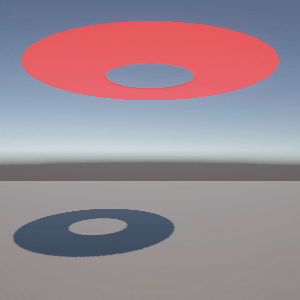

Write down the energy value at the 300th frame shown in the Debug output in the `Console` window

| energy at 300th frame |
|-----------------------|
| ???                   |


## Problem 2: Blender rendering

In the previous step, you animate a mesh of cloth. 
Play the Unity project for more than the 500th frame, then you will see `pba-<username>/tas07/task07/Assets/MyCloth.obj`.
Let's visualize the mesh nicely using Blender. 

### Launch Blender
  - Launch Blender. 
  - You will see a default cube in the `3D viewport` window. Remove it by `x` key or right click menu `Delete`.
  - Save the project somewhere **outside** the repository.  
  - See the image below for the name of the windows in Blender. 

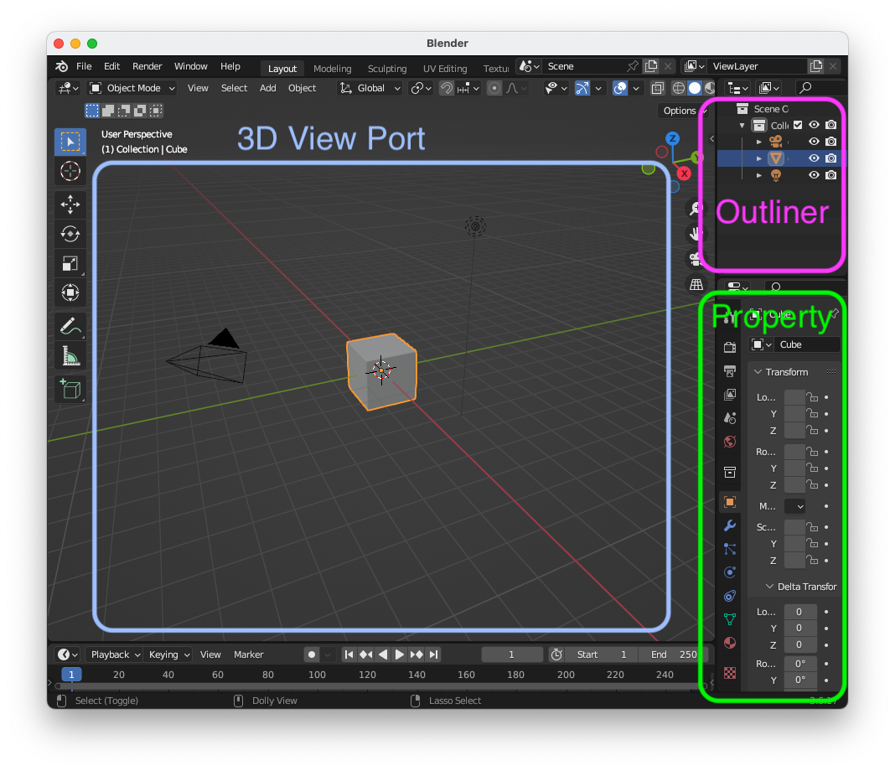

### Model Import
  
  - In Blender, import the `pba-<username>/tas07/task07/Assets/MyCloth.obj` by selecting the menu `File > Import > Wavefront (.obj)`.   
  - Make sure the `MyCloth.obj` is successfully imported and shown in the `3D Viewport` window.

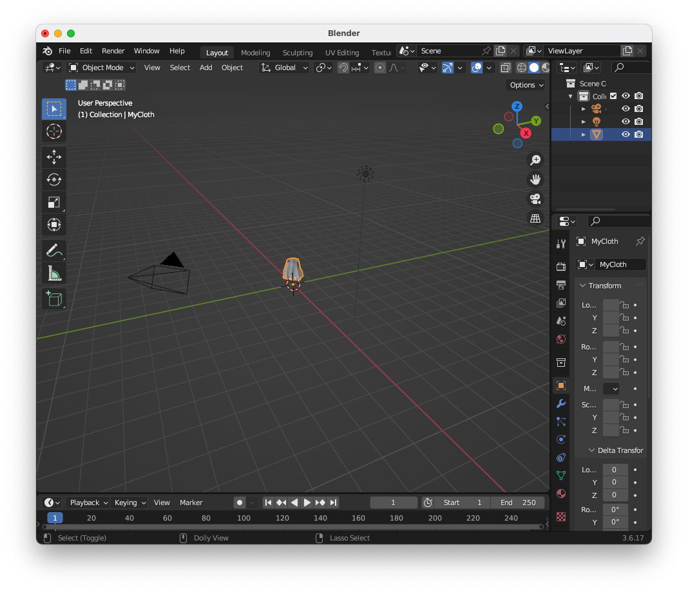

### Camera Setting
  - Select `Camera` in the `Outliner` window.  
  - Select `Object` tab in the `Property` window. 
  - Set the camera transform as Location: `(X:0m, Y: 5m, Z: 1m)`, Rotation: `(X:90deg, Y: 0deg, Z: 180deg)`, Mode `XYZ Euler`, Scale: `(1.0, 1.0, 1.0)`.
  - Press `F12` key to see the rendered result, making sure the `MyCloth.obj` is rendered around the center of the image.

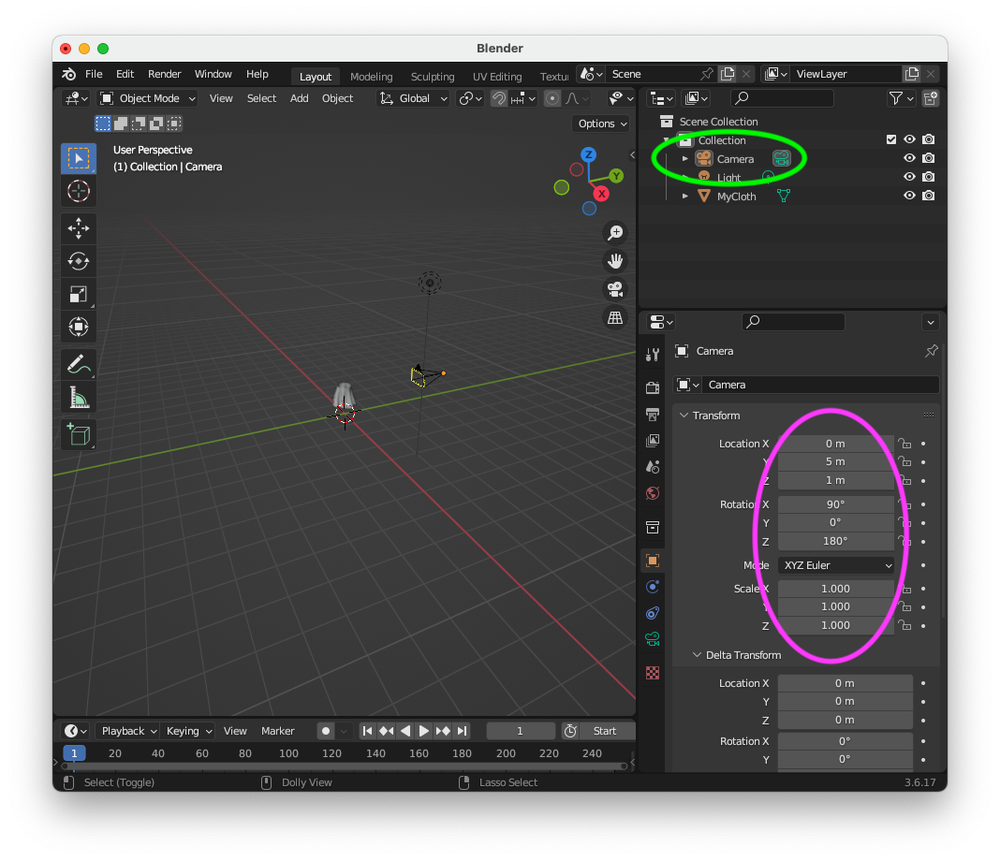

### Output Image Resolution Setting 
  - Select `Output` tab in the `Property` window. 
  - Set the Resolution X as `400 px`, Resolution Y as `300 px`. 
  - Press `F12` key to see the rendered result.

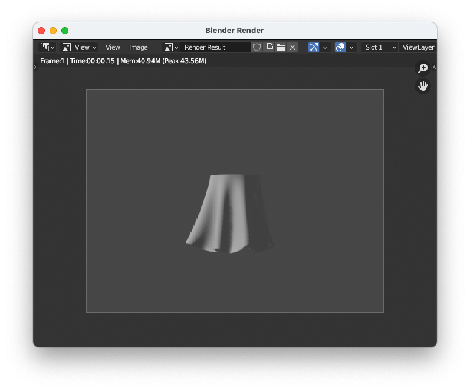
 
### Shader Editor
  - Split the window into two. You can do this by dragging the corner of a window (see [Blender how to split screen and remove split screen @ blenderrian
  ](https://www.youtube.com/watch?v=qp9E_S4iIkE)). 
  - In the right `3D Viewport`window, press the button `Editor type` in the top-left corner, and select the `Shader Editor`.
  - At the top of `Shader Editor` window click a dropdown menu showing `Object`. Change the data from `Object` to `World`. This is necessary to work with environmental textures.

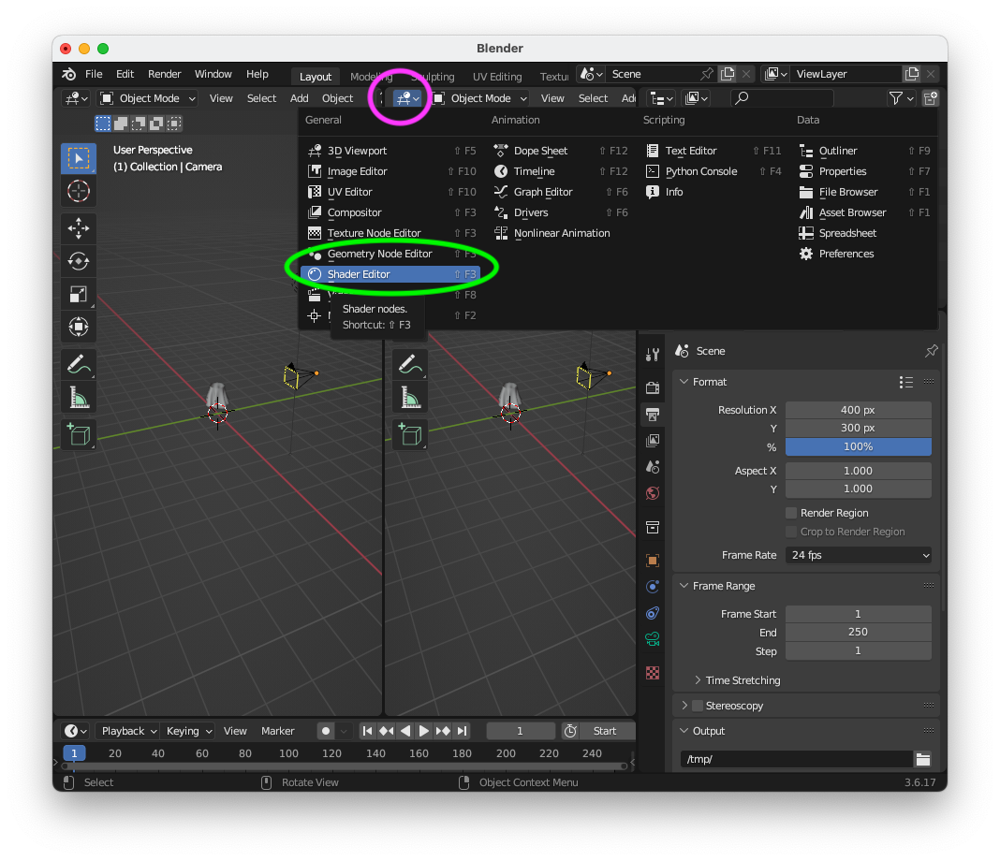

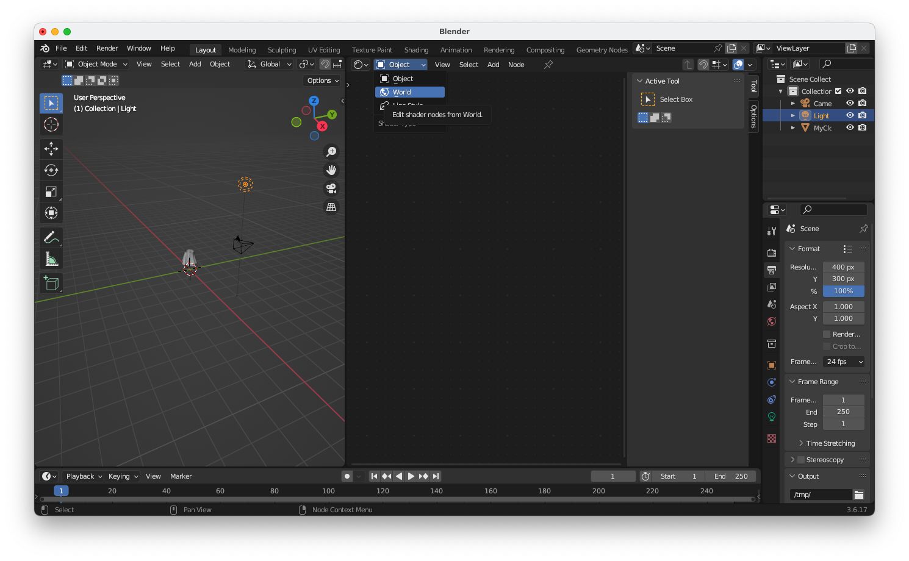

### Environmental Lighting
  - Go to Polyhaven (https://polyhaven.com/hdris), download HDR image such as https://polyhaven.com/a/golden_gate_hills. Download with 1k image with EXR format. Save it somewhere outside the repository.   
  - In the `Shader editor` node, press `Shift + A` to bring up the `Add` menu.
  - Navigate to `Texture` and then choose `Environment Texture`.
  - The `Environment Texture` node is created, but it won't show anything unless you connect it to the shader system.
  - Connect the `Environment Texture` node to the `Background shader` node by clicking and dragging the `output` of the `Environment Texture` node (the yellow dot) to the `input` (the green dot) of the `Background` shader node .
  - In the `Environment Texture` node, click the `Open` button.
  - Select the HDR image you saved on your computer.
  - If the instruction is difficult to follow, watch [The ULTIMATE GUIDE to HDRI Lighting in Blender! @ CG Essentials](https://youtu.be/N3DZL56cG84?si=std5BHYA6Jg7EIjN&t=80).

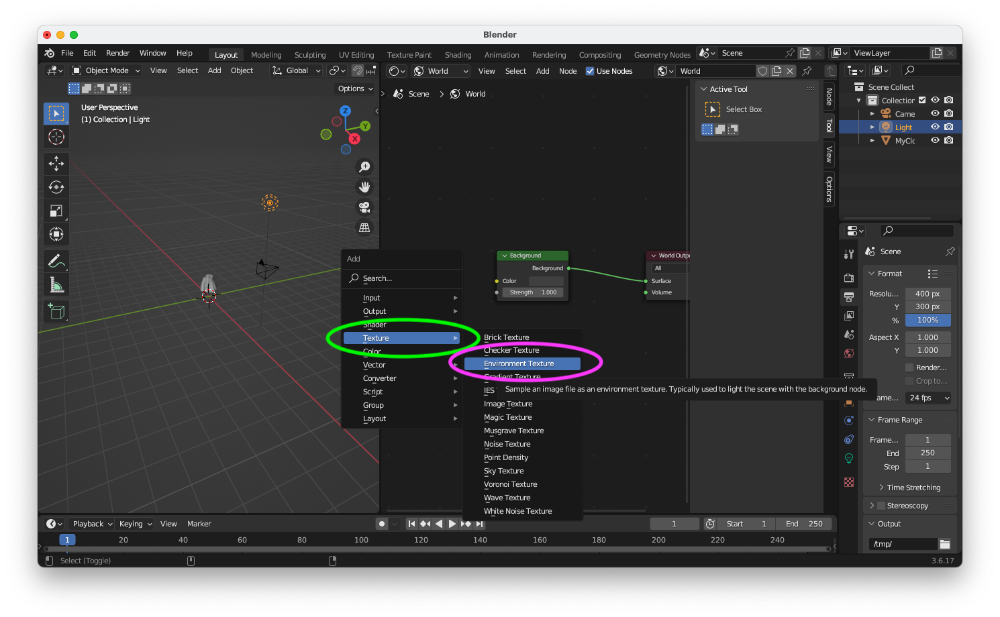

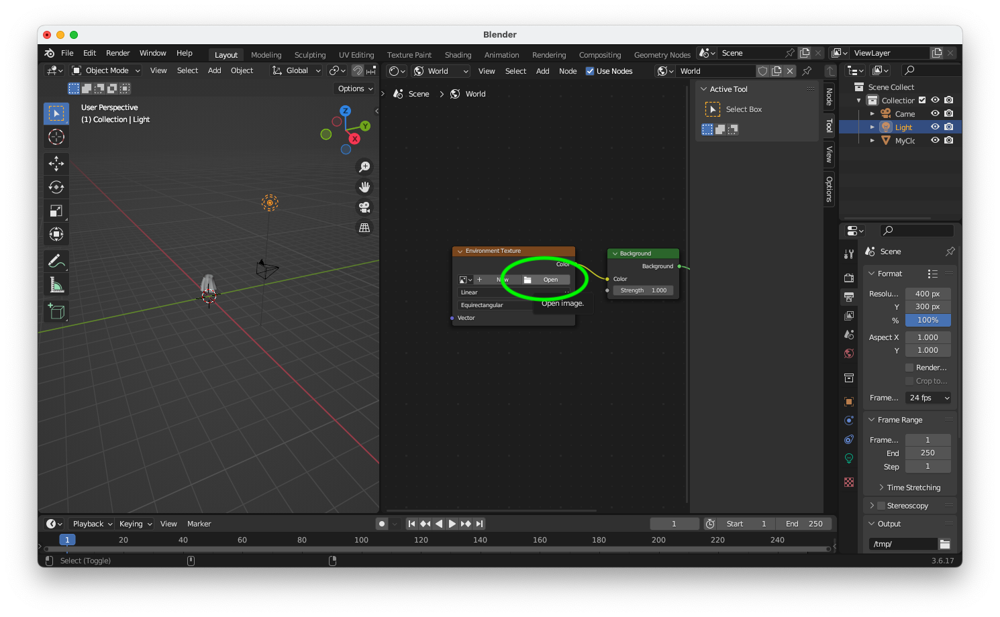

### Set-up Material
  - Select `MyCloth` in the `Outliner` window.
  - Select `Material` tab in the `Property` window 
  - Select `New` in the `Property` window.
  - Set `Base Color` as `(Red: 1.0, Green: 0.0, Blue: 0.0)`, `Metallic` as `0.3`, and `Roughness` around `0.2`.

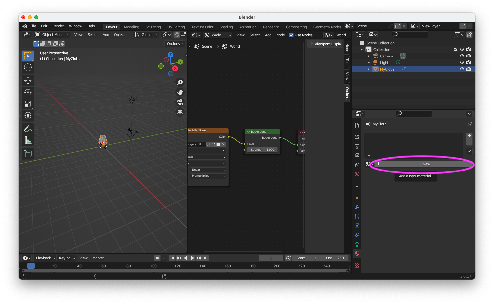

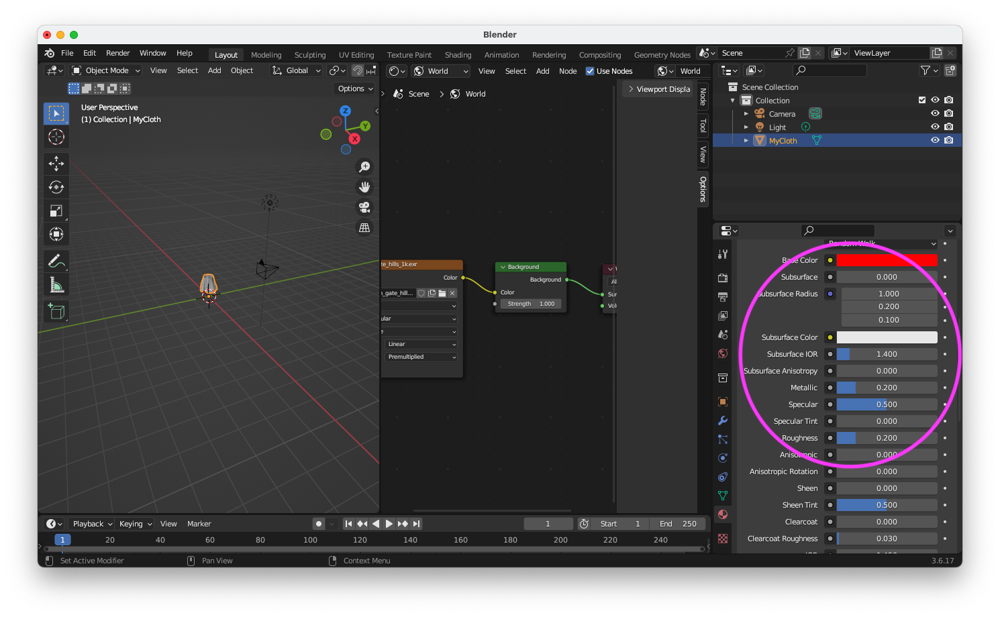

Finally, press `F12` key to see the rendered result. In the `Blender Render` window, save the image as `pba-<username>/task07/problem1.png`. 

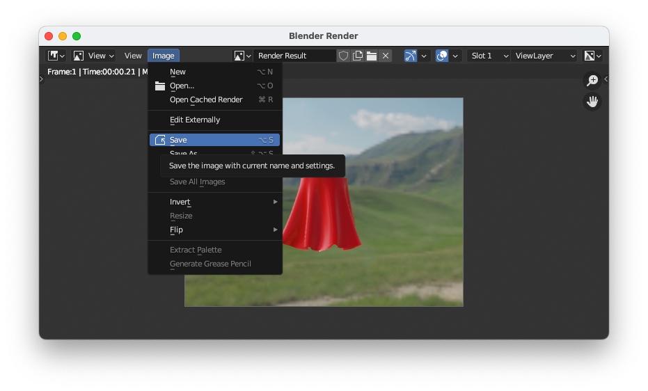

The image needs to be shown below.

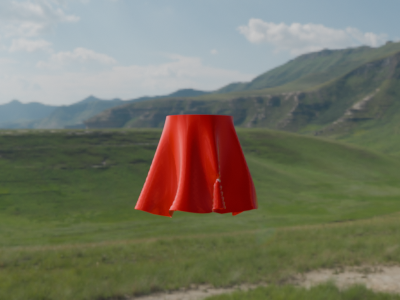


## After Doing the Assignment

After modifying the code, push the code and submit a pull request.


## Notes
- Please leave the project files under `pba-<username>/task07/task07/`. The `.gitignore` will ignore the unnecessary intermediate binaries.  
- The lecture do not explain detail of Unity and C#. Find your self on the internet or using chat AI (e.g., ChatGPT).
- Do not submit multiple pull requests. Only the first pull request is graded
- Do not close the pull request by yourself. The instructor will close the pull request
- If you mistakenly merge the pull request, it's OK, but be careful not to merge next time.
