# Task08: Controlling Volume of a Mesh using Lagrange-Multiplier Method

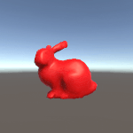

**Deadline: June 26 (Thu) at 15:00pm**

----

## Before Doing Assignment

If you have not installed Unity & Blender on your computer, install them if they are not installed on your computer.

First, update your local repository.

```bash
$ cd pba-<username>  # go to the local repository
$ git checkout main  # set main branch as the current branch
$ git branch -a       # make sure you are in the main branch
$ git fetch origin main  # download the main branch from the remote repository
$ git reset --hard origin/main # reset the local main branch same as remote repository
```

If you encounter some errors, give up updating your local repository and restart from the remote repository.
In other words, clone the remote repository in a new location (see [task00](../task00) for cloning).

Create the `task08` branch and set it as the current branch.

```bash
$ git branch task08    # create task08 branch
$ git checkout task08  # switch into the task08 branch
$ git branch -a        # make sure you are in the task08 branch
```

Now you are ready to go!

---

## Problem 1

Do the following procedure (mostly similar to `task06` and `task07`).

### Create Project
- In the `UnityHub`, make a new Unity project named `task08` under `pba-<username>/task08`.
- You will see project related folders like `pba-<username>/task08/task08/Assets`.

### Set Camera
- Set the position of the `Main Camera` to `(0.0, 0.0, -2.0)`.
- Keep the other parameters default (Field of View is `60`).
- Set the window resolution to `300x300`.

### Import Mesh
- Import the `pba-<username>/task08/bunny.obj` to the asset by dragging it into the `Assets` window (bottom).
- Click `bunny` prefab in the `Assets` window. You will see `inspector` window on the right. In the `Model` tab, enable `Read/Write` checkbox.
- Import the `bunny` Prefab to the scene by dragging `bunny` in the `Assets` window (bottom) to the `Hierarchy` window (top-left).
- In the `Hierarchy`window, click `default` GameObject under the `bunny` prefab.
- Make sure you will see the bunny in the `Game` window.

### Set Material to the Mesh
- Make a new material by selecting the right click menu in the `Assets` window (bottom) `Create > Rendering > Material`.
- Click the `New Material` in the `Asssets` window (bottom) to show `Inspector`window (right)
- Set the material color red by click the `Base Map` and set the RGB color as `(255,0,0)`.
- Click the `Render Face` pull down manu in `Surface Options` and select `Both`
- Drag the `New Material` to the `bunny > default` in the `Hiearchy` window (left).

### Attach the Codes
- Drag following CSharp codes to the `Assets` window. 
  - `pba-<username>/task08/MyInflater.cs` 
  - `pba-<username>/task08/TopologyOfUniformMesh.cs`
  - `pba-<username>/task08/BlockSparseMatrix.cs`
  - `pba-<username>/task08/ObjExporterToAssets.cs`
- Attach `Infrater.cs` in the `Assets` window to the `default` GameObject in the `bunny` Prefab.

### Edit the Codes

Now let's minimize the spring energy while setting the volume constraint using the Lagrange multiplier method. 

Write a few lines of code around `line #172` in the `pba-<username>/task08/task08/MyInflater.cs` to compute gradient of the volume of tetrahedron connecting the origin and 3 points.
Note that the volume of a water-tight mesh can be computed as the sum of the volume of tetrahedral connecting the origin and the triangle corners.   

Write a few lines of code around `line #78` in the `pba-<username>/task08/task08/MyInflater.cs` to compute add elements related to the lagrange multiplier to the block sparse matrix and the right-hand-side (RHS) vector. 
Note that, the block sparse matrix is consist of set of 3x3 matrix. 
The last two columns and the last two rows are kept zero (see picture below).

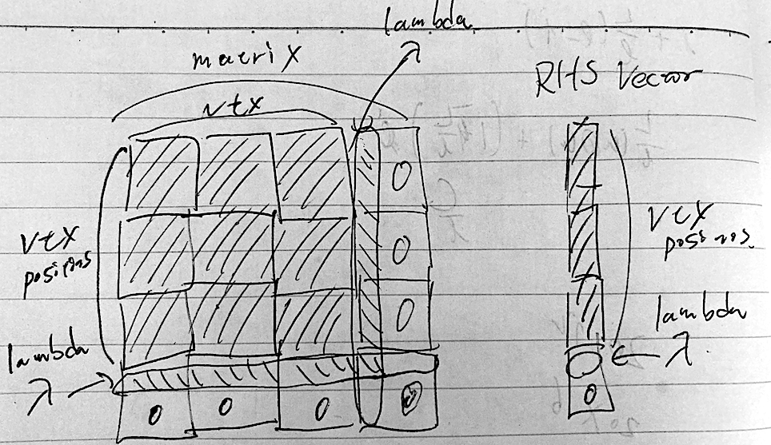


### Take a screenshot
- Make sure the window resolution to 300x300.
- Set up the `Recorder` package for screenshot video (see the [Lecture Material about Unity](http://nobuyuki-umetani.com/pba2025s/unity.pdf))
- Capture the screen from 0th to 300th frame.
- Rename the screenshot image and place it as `pba-<username>/task08/problem1.gif`

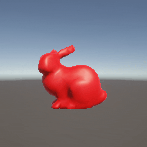

Write down the energy value at the 300th frame shown in the Debug output in the `Console` window

| energy at 300th frame | lambda at 300th frame |
|-----------------------|-----------------------|
| ???                   | ???                   |


## Problem 2: Blender rendering

In the previous step, you inflate a bunny mesh. 
Play the Unity project for more than the 160th frame, then you will see a mesh exported as `pba-<username>/tas08/task08/Assets/task08.obj`.
Let's visualize it nicely using Blender.

Follow the [task07's document](`../task07/README.md`) to 
  - launch Blender
  - import `pba-<username>/tas08/task08/Assets/task08.obj`
  - set the camera position `(X:0m, Y: 2.5m, Z: 0.5m)`, rotation `(X: 78deg, Y: 0deg, Z: 180deg)`, and scale `(1.0, 1.0, 1.0)`.
  - set the output image resolution X as `400 px`, Resolution Y as `300 px`.
  - set the material as `Base Color` as `(Red: 1.0, Green: 0.0, Blue: 0.0)`, `Metallic` as `0.3`, and `Roughness` around `0.2`.

Let's visualize edge of the mesh as black

### Add Material for Edge
- Click `task08` in the `Outliner` window
- In the `Properties` window (right-bottom), select `Material` tab.
- You see one red material. We add black material here.
- Click `+` button, in the `Material` window. Then click the `New` button.
- For the `Surface` entry, select `Diffuse BSDF`.
- Set the `Color` as `(Red: 0.0, Green: 0.0, Blue: 0.0)`

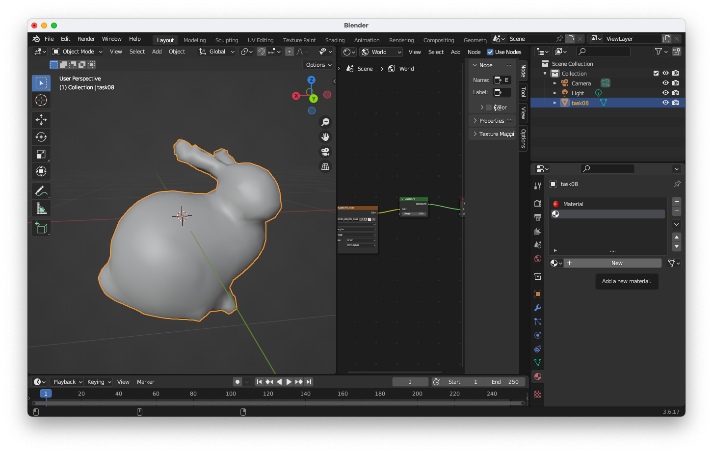

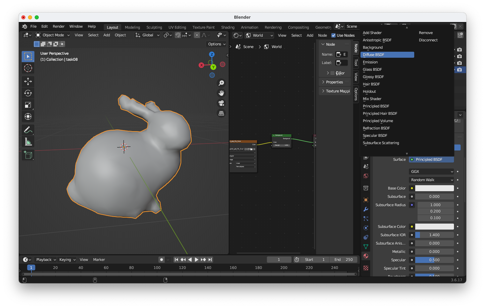

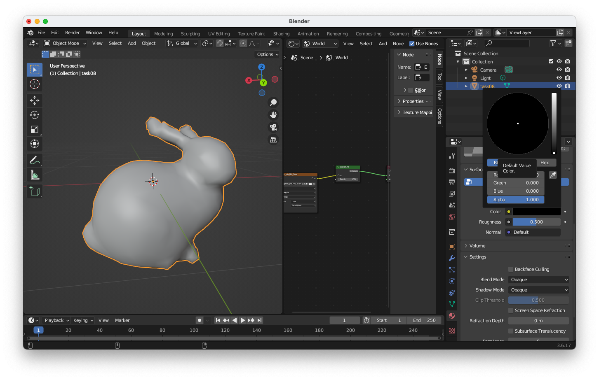

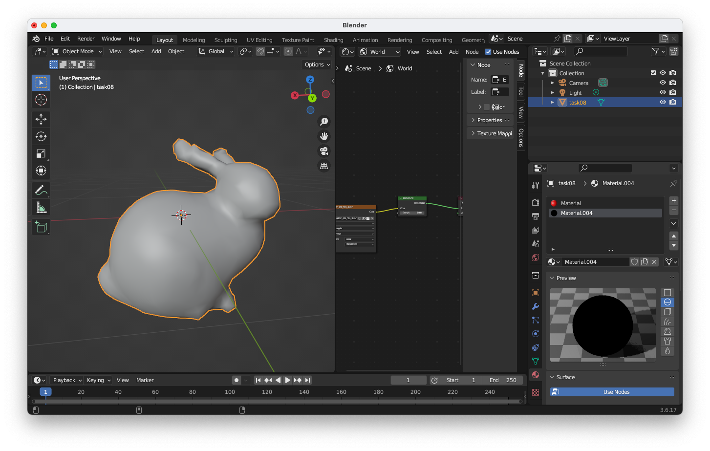

### Add Modifier 
- Click `task08` in the `Outliner` window
- In the `Properties` window (right-bottom), select `Modifiers` tab.
- Click the `Add Modifier` button and select `Wireframe`.
- In the `Wireframe` modifier's property window, set the `Thickness` as `0.01`, uncheck `Replace Original`, and `Material Offset` as 1 (render edge using 2nd material).

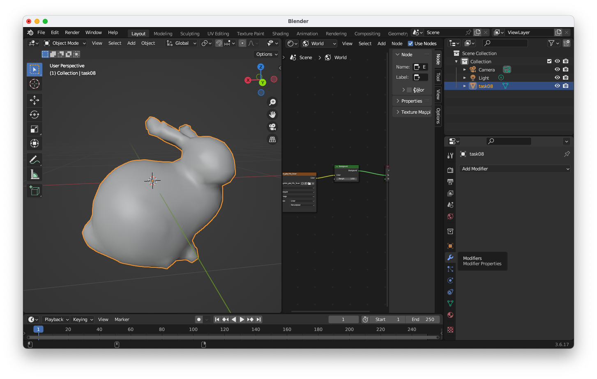

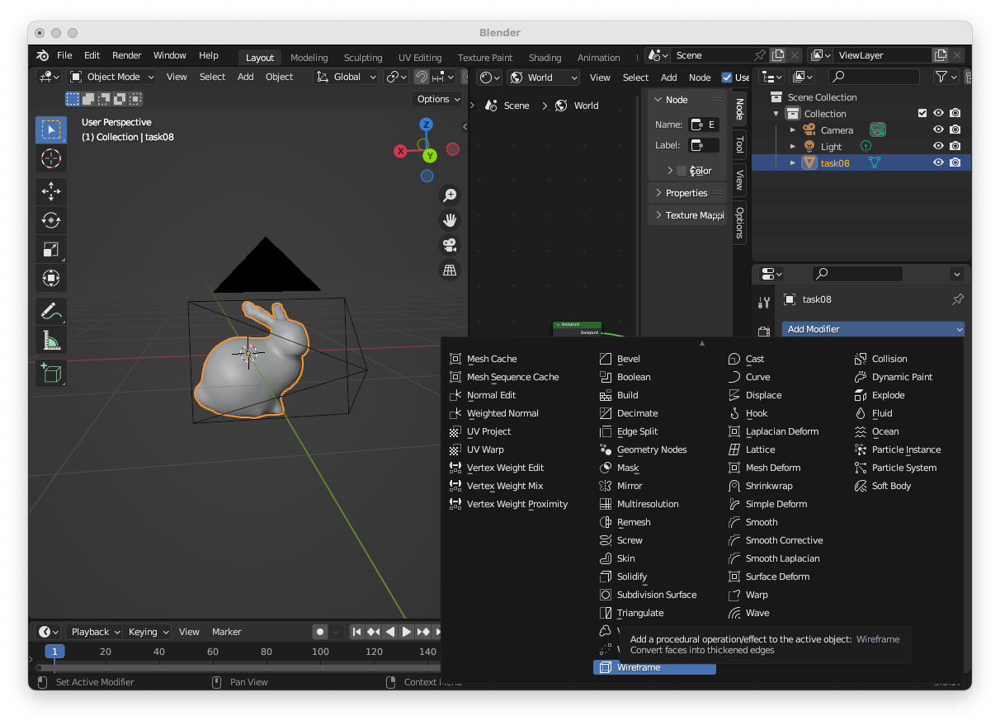

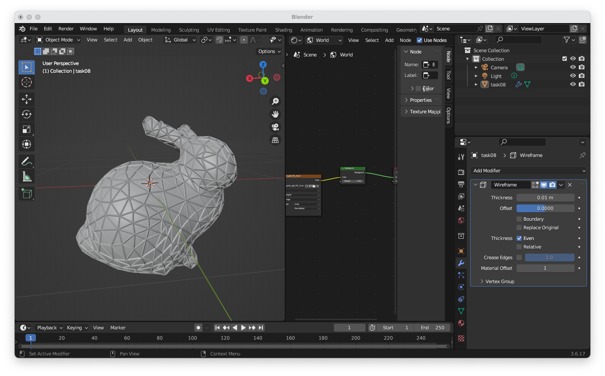

Finally, press `F12` key to see the rendered result. In the `Blender Render` window, save the image as `pba-<username>/task08/problem2.png`. 

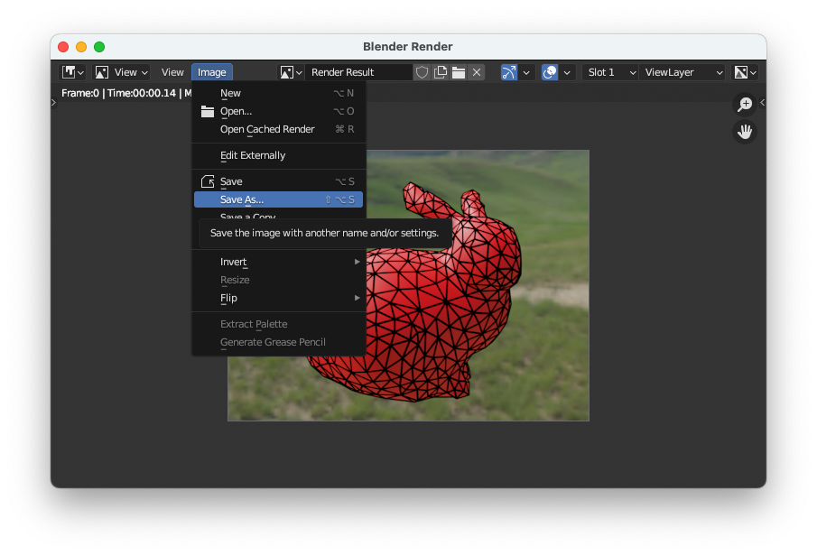

The image needs to be shown below.

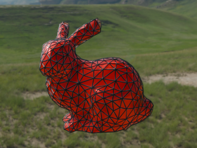


## After Doing the Assignment

After modifying the code, push the code and submit a pull request.


## Notes
- Please leave the project files under `pba-<username>/task08/task08/`. The `.gitignore` will ignore the unnecessary intermediate binaries.  
- The lecture do not explain detail of Unity and C#. Find your self on the internet or using chat AI (e.g., ChatGPT).
- Do not submit multiple pull requests. Only the first pull request is graded
- Do not close the pull request by yourself. The instructor will close the pull request
- If you mistakenly merge the pull request, it's OK, but be careful not to merge next time.
