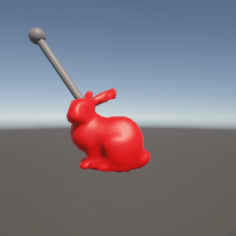

# Task09: Rotation and Energy Minimization


**Deadline: July 3rd (Thu) at 15:00pm**

----

## Before Doing Assignment

If you have not installed Unity on your computer, install it.

First, update your local repository.

```bash
$ cd pba-<username>  # go to the local repository
$ git checkout main  # set main branch as the current branch
$ git branch -a       # make sure you are in the main branch
$ git fetch origin main  # download the main branch from the remote repository
$ git reset --hard origin/main # reset the local main branch same as remote repository
```

If you encounter some errors, give up updating your local repository and restart from the remote repository.
In other words, clone the remote repository in a new location (see [task00](../task00) for cloning).

Create the `task09` branch and set it as the current branch.

```bash
$ git branch task09    # create task09 branch
$ git checkout task09  # switch into the task09 branch
$ git branch -a        # make sure you are in the task09 branch
```

Now you are ready to go!

---

## Problem 1

Do the following procedure (mostly similar to `task06`, `task07`, `task08`).

### Create Project
- In the `UnityHub`, make a new Unity project named `task09` under `pba-<username>/task09`.
- You will see project related folders like `pba-<username>/task09/task09/Assets`.

### Set Camera
- Set the position of the `Main Camera` to `(0.0, 0.0, -2.5)`.
- Keep the other parameters default (Field of View is `60`).
- Set the window resolution to `300x300`.

### Import Mesh
- Import the `pba-<username>/task09/bunny.obj` to the asset by dragging it into the `Assets` window (bottom).
- Click `bunny` prefab in the `Assets` window. You will see `inspector` window on the right. In the `Model` tab, enable `Read/Write` checkbox.
- Import the `bunny` Prefab to the scene by dragging `bunny` in the `Assets` window (bottom) to the `Hierarchy` window (top-left).
- In the `Hierarchy`window, click `default` GameObject under the `bunny` prefab.
- Make sure you will see the bunny in the `Game` window.

### Set a Material to the Mesh
- Make a new material by selecting the right click menu in the `Assets` window (bottom) `Create > Rendering > Material`.
- Click the `New Material` in the `Asssets` window (bottom) to show `Inspector`window (right)
- Set the material color red by click the `Base Map` and set the RGB color as `(255,0,0)`.
- Drag the `New Material` to the `bunny > default` in the `Hiearchy` window (left).

### Attach the Codes
- Drag following CSharp codes to the `Assets` window. 
  - `pba-<username>/task09/MyHangerGD.cs`
- Attach `MyHangerGD` in the `Assets` window to the `default` GameObject in the `bunny` Prefab.

### Edit the Codes

Now let's minimize the potential energy using the gradient descent method. This bunny is filled with uniform material with constant density `1.0`.

First compute the center of gravity (cog) by write a few line of code around `line #29` in the `pba-<username>/task09/task09/MyHangerGD.cs`.　
Write the coordinate of the center of gravity below.

| the center of gravity |
|-----------------------|
| (?, ?, ?)             |

Write a few lines of code around `line #70` in the `pba-<username>/task09/task09/MyHangerGD.cs`.


### Take a screenshot
- Make sure the window resolution to 300x300.
- Set up the `Recorder` package for screenshot video (see the [Lecture Material about Unity](http://nobuyuki-umetani.com/pba2025s/unity.pdf))
- Capture the screen from 0th to 300th frame.
- Rename the screenshot image and place it as `pba-<username>/task09/problem1.gif`



Write down the energy value at the 300th frame shown in the Debug output in the `Console` window.

| energy at 300th frame |
|-----------------------|
| ???                   |


## After Doing the Assignment

After modifying the code, push the code and submit a pull request.


## Notes
- Please leave the project files under `pba-<username>/task09/task09/`. The `.gitignore` will ignore the unnecessary intermediate binaries.  
- The lecture do not explain detail of Unity and C#. Find your self on the internet or using chat AI (e.g., ChatGPT).
- Do not submit multiple pull requests. Only the first pull request is graded
- Do not close the pull request by yourself. The instructor will close the pull request
- If you mistakenly merge the pull request, it's OK, but be careful not to merge next time.
