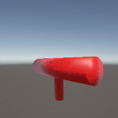
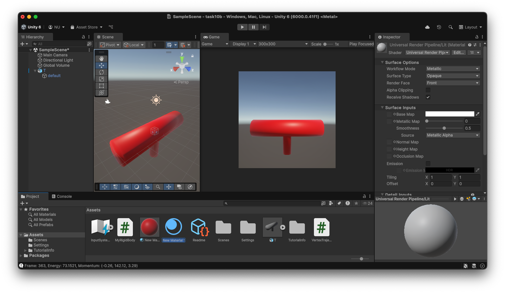
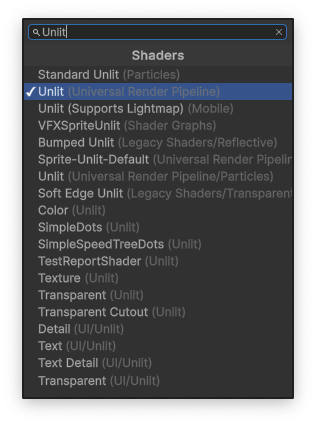
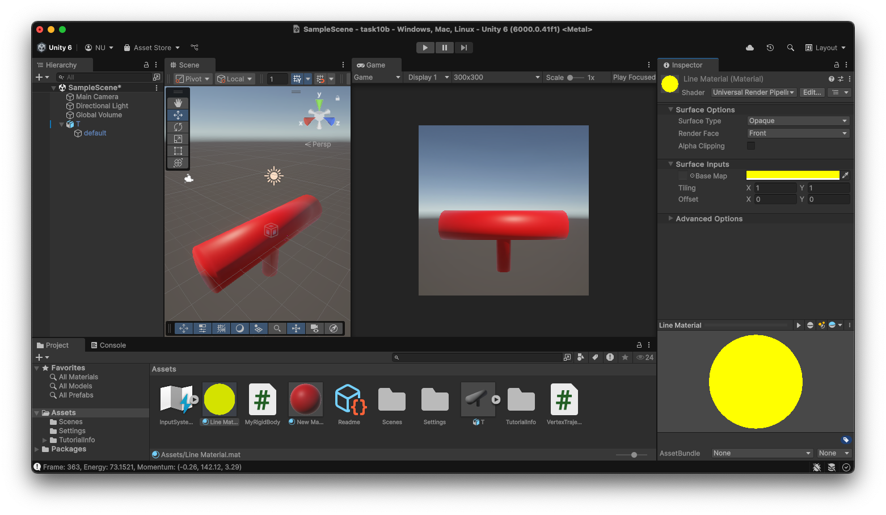
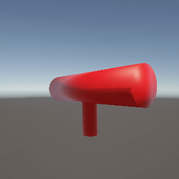

# Task10: Simulation of Rigid Body Precession 



**Deadline: July 10th (Thu) at 15:00pm**

----

## Before Doing Assignment

If you have not installed Unity on your computer, install it.

First, update your local repository.

```bash
$ cd pba-<username>  # go to the local repository
$ git checkout main  # set main branch as the current branch
$ git branch -a       # make sure you are in the main branch
$ git fetch origin main  # download the main branch from the remote repository
$ git reset --hard origin/main # reset the local main branch same as remote repository
```

If you encounter some errors, give up updating your local repository and restart from the remote repository.
In other words, clone the remote repository in a new location (see [task00](../task00) for cloning).

Create the `task10` branch and set it as the current branch.

```bash
$ git branch task10    # create task10 branch
$ git checkout task10  # switch into the task10 branch
$ git branch -a        # make sure you are in the task10 branch
```

Now you are ready to go!

---

## Problem 1

Do the following procedure (mostly similar to `task06`, `task07`, `task08`, and `task09`).

### Create Project
- In the `UnityHub`, make a new Unity project named `task10` under `pba-<username>/task10`.
- You will see project related folders like `pba-<username>/task10/task10/Assets`.

### Set Camera
- Make sure the position of the `Main Camera` is at `(0.0, 0.0, -10.0)`.
- Keep the other parameters default (Field of View is `60`).
- Set the window resolution to `300x300`.

### Import Mesh
- Import the `pba-<username>/task10/T.obj` to the asset by dragging it into the `Assets` window (bottom).
- Click `T` prefab in the `Assets` window. You will see `inspector` window on the right. In the `Model` tab, enable `Read/Write` checkbox.
- Import the `T` Prefab to the scene by dragging `T` in the `Assets` window (bottom) to the `Hierarchy` window (top-left).
- In the `Hierarchy`window, click `default` GameObject under the `T` prefab.
- Make sure you will see the T-shaped object in the `Game` window.

### Attach Line Renderer
- In the `Hierarchy`window, click `default` GameObject under the `T` prefab.
- In the `Inspector` window, click `Add Component` button, search for `Line Renderer` and add it.

### Set a Material to the Mesh
- Make a new material by selecting the right click menu in the `Assets` window (bottom) `Create > Rendering > Material`.
- Click the `New Material` in the `Asssets` window (bottom) to show `Inspector`window (right)
- Set the material color red by click the `Base Map` and set the RGB color as `(255,0,0)`.
- Drag the `New Material` to the `T > default` in the `Hiearchy` window (left).

### Set a Material to the Line Renderer
- Make a new material by selecting the right click menu in the `Assets` window (bottom) `Create > Rendering > Material`.
- Change the new material name to `Line Material` in the `Assets` window. 
- Click the `Line Material` in the `Asssets` window (bottom) to show `Inspector`window (right)


- In the `Shader`, search for `Unlit (Universal Render Pipeline)`


- Set the material color red by click the `Base Map` and set the RGB color as `(255,255,0)`.


- Click the `T > default` in the `Hiearchy` window (left).
- Drag the `Line Material` to the `Line Renderer` component in  `T > default` game object in the `Inspector` window (right).


### Attach the Codes
- Drag following CSharp codes to the `Assets` window. 
  - `pba-<username>/task10/MyRigidBody.cs`
  - `pba-<username>/task10/VertexTrajectory.cs`
- Attach `MyRigidBody` and `VertexTrajectory` in the `Assets` window to the `default` GameObject in the `T` Prefab.

### Edit the Codes

Now let's simulate the rigid body rotation.

First compute the inertia tensor by writing a few line of code around `line #90` in the `pba-<username>/task10/task10/MyRigidBody.cs`.　
Assume that the T-shaped object is solid object with mass density `1.0f`.　
Here we compute the inertia tensor in the reference configuration. 
Write the inertia tensor below.

|   | 0 | 1 | 2 |
|---|---|---|---|
| 0 | ? | ? | ? |
| 1 | ? | ? | ? |
| 2 | ? | ? | ? |

Note that the inertia tensor is symmetric.   


Write a few lines of code around `line #38` in the `pba-<username>/task10/task10/MyRigidBody.cs`.

Write down the energy and angular momentum value at the 300th frame shown in the Debug output in the `Console` window.

| energy at 300th frame | angular momentum at 300th frame |
|-----------------------|---------------------------------|
| ???                   | ???                             |

Note that the both energy and angular momentum does not change very much during this simulation (the energy keep increasing gradually as we use forward Euler method in angular velocity update).

### Take a screenshot
- Make sure the window resolution to 300x300.
- Set up the `Recorder` package for screenshot video (see the [Lecture Material about Unity](http://nobuyuki-umetani.com/pba2025s/unity.pdf))
- Capture the screen from 0th to 300th frame.
- Rename the screenshot image and place it as `pba-<username>/task10/problem1.gif`




## After Doing the Assignment

After modifying the code, push the code and submit a pull request.


## Notes
- Please leave the project files under `pba-<username>/task10/task10/`. The `.gitignore` will ignore the unnecessary intermediate binaries.  
- The lecture do not explain detail of Unity and C#. Find your self on the internet or using chat AI (e.g., ChatGPT).
- Do not submit multiple pull requests. Only the first pull request is graded
- Do not close the pull request by yourself. The instructor will close the pull request
- If you mistakenly merge the pull request, it's OK, but be careful not to merge next time.
